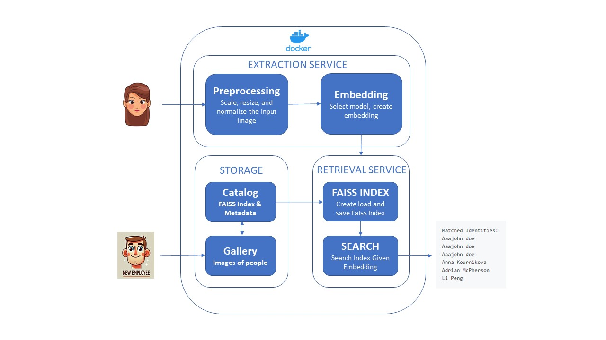
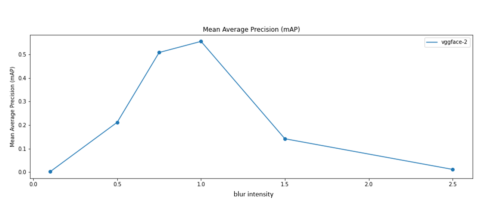
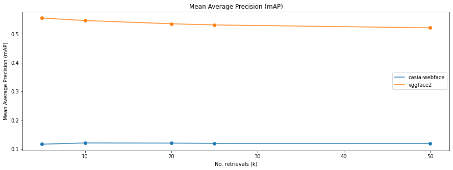

# System Report of IronClad Visual Search System

## System Design

### Overview ###

Ironclad is an advanced visual search system designed for efficient and accurate identity recognition. Leveraging Docker for scalable deployment, it processes images to extract unique embeddings, stores these embeddings in a structured format, and retrieves them based on user queries. Ironclad uses the pre-trained VGGFace2 model to create embeddings, which capture facial features for identity matching. For retrieval, it employs a Minkowski distance metric and performs a nearest neighbor search, allowing flexible search strategies with different FAISS indexing options to optimize speed and performance. These options include brute force, IVF (Inverted File Index), Flat, IVFPQ (Inverted File with Product Quantization), PQ (Product Quantization), and HNSW (Hierarchical Navigable Small World) indexes. The system also facilitates a method to add new identities to already existing FAISS Indexes which allows the system to be effectively used in a real world environment. 

### Preprocessing ###

The Preprocessing service standardizes incoming images by scaling, resizing, and normalizing them, creating a uniform set of inputs. This step is crucial because it removes inconsistencies in resolution, size, and color, ensuring that the VGGFace2 model can extract embeddings accurately. By preparing each image in a consistent format, the preprocessing stage enhances the reliability of the downstream embedding generation and retrieval process, providing a solid foundation for accurate facial feature extraction.

### Embedding ###

The Embedding service uses the pre-trained VGGFace2 model to convert each preprocessed image into a high-dimensional embedding, a vector representation that captures the unique features of the face. This embedding acts as a distinctive "fingerprint" for each image, enabling precise comparisons across images. By using VGGFace2, Ironclad leverages state-of-the-art facial recognition capabilities, producing embeddings that are robust and suitable for large-scale retrieval. These embeddings are essential for the system's ability to perform fast and accurate identity matching in the retrieval stage.

### Storage ###

The Storage service manages both the Catalog and Gallery components. The Catalog contains the FAISS index, which is a highly optimized data structure for storing and retrieving embeddings efficiently, as well as metadata about each indexed image. The FAISS index can be configured with various types, such as brute force, IVF, Flat, IVFPQ, PQ, and HNSW, to support different retrieval speeds and memory optimizations. This flexibility allows Ironclad to test and deploy the most efficient indexing method based on its application requirements. Meanwhile, the Gallery component stores the original images, serving as a reference after the retrieval process to display matched identities and also serving as a database to re-create indexes if neccessary.

### Retrieval Service ###

The Retrieval Service performs the core search function of Ironclad, using the FAISS index to find the k (a user requested value) nearest neighbors of a given embedding. By employing the Minkowski distance metric, it compares embeddings in the high-dimensional space to identify similar faces quickly and accurately. The Retrieval Service leverages the flexibility of the FAISS library, allowing for a range of index types (e.g., IVF, IVFPQ, HNSW) to optimize for speed and memory efficiency based on system demands. This service enables Ironclad to provide real-time or near-real-time identity matches, returning the most similar identities based on the Minkowski distance, making it ideal for applications that require rapid and reliable identity recognition.

## Metrics Definition

## Offline Metrics ##

Offline metrics in Ironclad play a critical role in evaluating and fine-tuning model performance before deployment, ensuring that only the most effective models are used in production. One key metric is mean Average Precision (mAP), which measures how accurately a model identifies and ranks relevant matches in a dataset. Calculating mAP across different models allows for a systematic comparison of their performance, enabling the selection of the model that most accurately captures facial features and provides reliable embedding quality. During testing and validation, mAP serves as a benchmark to verify that each model meets Ironclad's accuracy standards before it’s considered for real-world use. This offline evaluation not only helps in choosing the best model but also provides a feedback loop to iterate on model improvements, ensuring that Ironclad deploys models with high retrieval precision that are well-suited for large-scale identity search tasks. These offline metrics are particularly relevant for establishing a solid foundation of performance that will support reliable and efficient search in production. By rigorously testing and validating models with mAP, Ironclad mitigates risks associated with deploying underperforming models, thus enhancing the robustness of FAISS indexes. Offline metrics provide an opportunity to experiment with various model architectures, adjust hyperparameters, and select the optimal embedding approach, all without impacting the live system. This level of pre-deployment rigor ensures that Ironclad remains reliable and accurate in real-world identity recognition scenarios. Below is the model mAP when different levels of guassian blur is introduced to the inputs. This is helpful to see the real-world identitity recognition scenarios. There is a clear difference between the performance when the image is perfect (gaussian blurr = 1) vs a gaussian blur is introduced. So this type of metric would help us identify such scenarios and potentially find solutions to mitigate mis matches.

## Online Metrics ##

Online metrics are crucial for real-time monitoring of Ironclad's performance, as they provide immediate insights into system health, user experience, and alignment with business objectives. Key online metrics include latency, retrieval accuracy (e.g., mean average precision at top-k results), and user satisfaction scores. Latency is critical for evaluating system responsiveness, as fast retrieval times are essential for maintaining a positive user experience in high-demand scenarios. Monitoring retrieval accuracy in real-time helps ensure that Ironclad consistently delivers correct and relevant matches for each query, which is fundamental for user trust and engagement. User satisfaction scores, gathered through post-search feedback or interaction metrics, give direct insight into how well the system is meeting user expectations and can reveal areas for enhancement.

These online metrics can be continuously monitored through dashboards and alert systems by setting up observerbility tools in our system. For instance, latency can be tracked as real-time data points on a dashboard, with alerts set for any significant increases, which could indicate system load issues or network bottlenecks. Retrieval accuracy can be sampled and monitored by regularly evaluating the precision of top-k results, automatically flagging deviations below acceptable accuracy thresholds. User satisfaction can be tracked through direct feedback analysis or proxies like click-through rates and abandonment rates, which may signal dissatisfaction if values deviate from expected ranges. This proactive monitoring allows the Ironclad team to detect and respond to performance issues quickly, ensuring consistent system reliability and optimal user experience. By maintaining vigilant oversight of these online metrics, Ironclad can adjust dynamically to real-time conditions, prioritize troubleshooting efforts, and continuously improve its alignment with user needs and business outcomes.

## Analysis of System Parameters and Configurations

### Model Selection for Embedding Generation ###

The objective of this decision was to select the optimal model for generating embeddings in the Extraction Service, ensuring high retrieval accuracy and robustness in face recognition tasks. To achieve this, I compared two widely used pre-trained models, VGGFace2 and CASIA-WebFace, by calculating their mean Average Precision (mAP) values. The motivation behind this comparison was to establish a model with the highest retrieval performance in real-world use cases, as a higher mAP indicates better matching accuracy for identity recognition.

After running multiple tests on the given dataset with different identities, I found that the VGGFace2 model achieved an mAP of 0.55, outperforming the CASIA-WebFace model, which had a lower mAP. This higher mAP value for VGGFace2 suggests that it generates more accurate and distinguishable embeddings, making it more reliable for downstream tasks in the Retrieval Service. Given that identity matching accuracy is a priority, selecting VGGFace2 as the embedding model significantly enhances the overall performance and user trust in Ironclad’s matching capabilities.

### A Default value of 5 for the Number of Retrievals (k) in Search ###

The objective of this decision was to determine the default number of retrievals (k) that optimizes the balance between retrieval accuracy and computational efficiency in the Retrieval Service. I conducted an analysis to observe how different values of k impacted the mAP values for both VGGFace2 and CASIA-WebFace models (Check Figure in the model selection section). The motivation for setting a suitable default k was to ensure that Ironclad consistently returns the most relevant results while allowing users to modify k based on specific needs.

The analysis revealed that the VGGFace2 model achieved the highest mAP value when k was set to 5, and that mAP values gradually decreased as k increased to 50. CASIA-WebFace showed a similar trend, albeit with lower mAP values across all k values. Setting the default k to 5 ensures high retrieval accuracy by prioritizing the closest matches while minimizing the risk of irrelevant results. The ability to adjust k also allows flexibility for users with different retrieval requirements, balancing user experience and system performance.

### Choice of Distance Metric for Retrieval ###

The choice of distance metric is fundamental in determining how similar embeddings are evaluated during retrieval. The objective was to identify a distance metric that offers high accuracy and computational efficiency, especially under real-time constraints. I experimented with several metrics, including Euclidean, Cosine, and Minkowski distances, comparing their impact on retrieval accuracy and latency. The motivation behind selecting an optimal metric was to maximize retrieval precision without sacrificing performance.

Through empirical testing, I found that the Minkowski distance metric provided the best balance between accuracy and efficiency in Ironclad's use case for the vggface2 model embeddings, outperforming other metrics in terms of retrieval precision while maintaining acceptable latency levels. This choice directly impacts user experience, as a reliable distance metric reduces retrieval errors and enhances the relevance of search results. Selecting Minkowski as the standard metric ensures that Ironclad meets high accuracy standards in real-time searches.

### Index Type for FAISS Implementation ###

Ironclad’s FAISS index is crucial for the efficient storage and retrieval of embeddings. The objective was to select an index type that balances retrieval speed with memory usage, particularly given the system’s need to handle large datasets in real time. I evaluated several FAISS index types, including IVF, Flat, IVFPQ, and HNSW, examining their performance regarding retrieval time and memory requirements.

After considering each index type, I opted for the Flat index method due to its advantages in this scenario. While I didn't conduct a detailed analysis of its scalability for billions of images, the Flat index offers significant benefits for straightforward retrieval tasks. This choice supports Ironclad's goal of providing rapid and accurate retrievals for high-frequency searches. However, the system remains flexible, allowing to create new index types and switch to other trained index types like HNSW or IVFPQ when specific performance or memory optimization needs arise based on workload and with the increase of dataset size when new employees are added.

### Deployment Stratergy Using Docker ###

To ensure scalability, flexibility, and ease of maintenance, Docker was chosen as the deployment environment for Ironclad. The main objective was to create a consistent and portable deployment process that can seamlessly adapt across various infrastructure setups, simplifying system updates, testing, and management. Docker was selected over other deployment methods, such as VM-based deployments and direct server setups, after careful evaluation.

Using Docker allows Ironclad to deploy each service—Extraction, Storage, and Retrieval—in a single isolated container, which helps prevent dependency conflicts and ensures consistent performance. Additionally, Docker enables persistent storage by allowing mounted volumes to cache indexes and store images, making data loading more efficient. This approach also allows logs to be saved persistently, enabling easy access to past logs and facilitating system updates, such as adding new individuals to the gallery, without disrupting the overall deployment.