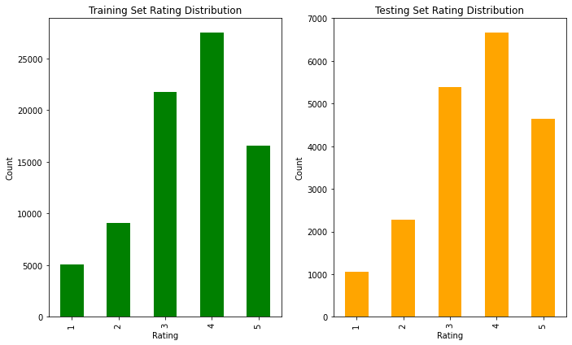
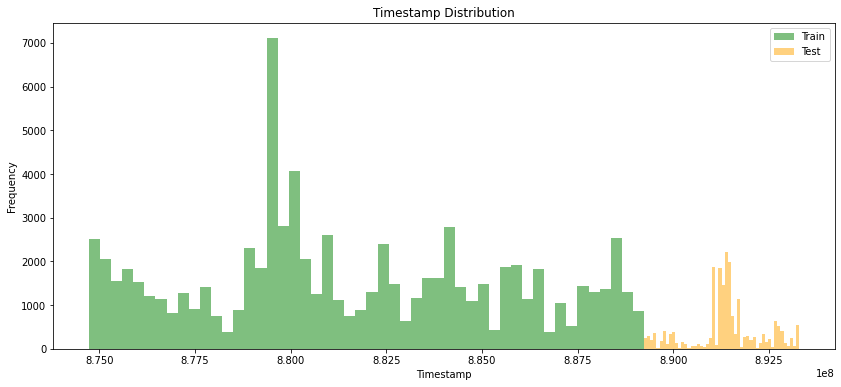
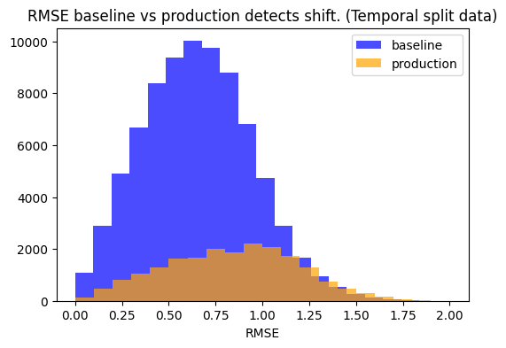
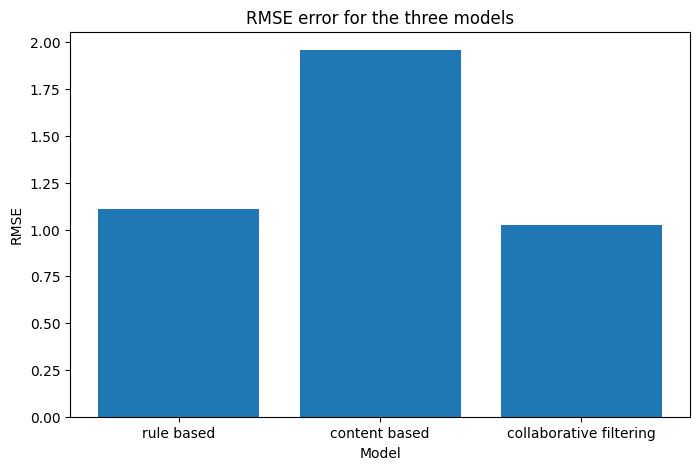
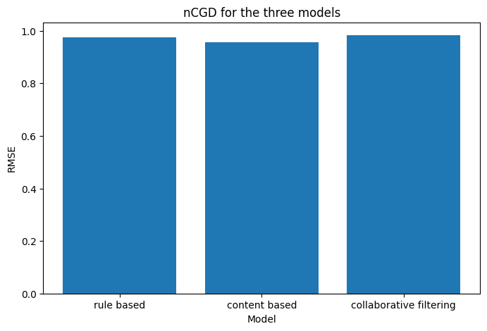
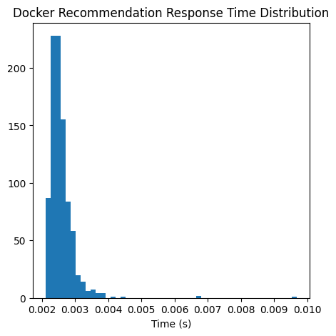

# System Report of Moviemate recommendation system

## System Design

### Overview ###
Moviemate is a movie recommendation system that suggests films to users based on ratings data. It consists of three main modules: the adaptive module, the personalization module, and the interface module. The adaptive module supports continuous learning, enabling the system to evolve over time. The recommender system employs a hybrid recommender system consting the collaborative and content based filtering, followed by a diversifier, to recommend movies tailored to individual user preferences. The interface module handles user logins and delivers movie recommendations to the end user.

### Adaptive Module ###
The adaptive module in Moviemate facilitates continuous learning by monitoring the performance of the recommendation model through a statistical evaluation of prediction errors. It uses a baseline dataset of RMSE (Root Mean Squared Error) values, representing the model's initial performance, and compares them against RMSE values generated from new user rating data using a Kolmogorov-Smirnov (KS) test. This test detects distributional drift between the baseline and production data, identifying significant deviations that might indicate model degradation. If the test determines drift, the system flags the need for retraining, allowing the recommendation model to adapt to changing user preferences or new trends in movie ratings. In the moviemate recommendation system, this is set up as a manual endpoint in the docker app to monitor the model performance and retrain if needed. 

### Personalization Module ###
The Personalization module combines a Recommender and a Diversifier to generate and refine item recommendations for users. The Recommender blends content-based and collaborative filtering predictions to rank items based on relevance scores for a given user. It uses a collaborative filtering model, such as SVD, trained on user ratings and metadata to predict user-item scores and produce initial ranked recommendations. Following this, the Diversifier reranks these recommendations by balancing relevance with diversity using customizable diversity measures like intra-list diversity and entropy. It adjusts scores based on a weighted combination of relevance and diversity, ensuring a more diverse yet relevant list of recommendations for the user. Together, these components deliver a hybrid system that prioritizes user-specific preferences while maintaining variety in recommendations.

### Interface Module ###
The interface module provides a seamless way for users to interact with the recommendation system. It includes a method for users to log in and access personalized recommendations based on their preferences and interactions. Additionally, the module supports adding new user information to the database, enabling the system to continuously adapt and include new users. This functionality ensures that both existing and new users can efficiently engage with the system and receive tailored recommendations.

## Metrics Definition

### Offline Metrics ###
Offline metrics are crucial for evaluating the performance of the recommendation system on historical data. Mean Reciprocal Rank (MRR) is used to measure how well the system ranks the first relevant item for users, reflecting its ability to prioritize relevance. Precision@K assesses the proportion of relevant items in the top K recommendations, while Recall@K evaluates the system’s ability to retrieve all relevant items within the top K. Mean Average Precision at K (mAP@K) provides a comprehensive measure of ranking quality by averaging precision across cutoff levels, accounting for both precision and recall. Normalized Discounted Cumulative Gain (nDCG) captures ranking quality by considering the relevance of items and their positions. Additionally, a Learning Stability Metric, used in the continuous learning section, can be used to evaluate how well the system adapts over iterations. 

### Online Metrics ###
Online metrics are used to monitor the recommendation system's performance in real-time, reflecting user interactions and satisfaction. Precision@K is monitored to ensure the system provides relevant recommendations at the moment of interaction, while Recall@K tracks the system’s ability to display diverse relevant content during live usage. nDCG can also be observed to understand if the most relevant recommendations are positioned effectively for user engagement. MRR is also particularly useful for assessing the effectiveness of the system in surfacing highly relevant items promptly. These metrics can be monitored via cloud dashboards or logging frameworks to track performance trends and anomalies in real time. By continuously evaluating these metrics in real-time, the system can adapt to changes in user behavior and ensure a consistent, high-quality recommendation experience.

## Analysis of Designing Parameters and Configurations

**1. Adaptive service: Using a temporal data split to train/retrain models.**

In recommendation systems, data is naturally sequential. For instance, users’ ratings evolve over time, influenced by changing preferences, trends, and new content. Temporal partitioning ensures that the model is trained on data from the past and tested on future data, mimicking real-world deployment scenarios. The image below illustrates this point: the green (train) data is distributed earlier in time, while the yellow (test) data occurs later. This mirrors the system's operation after deployment, where the model must predict future behavior based on historical data.

Non-temporal splits (e.g., random) risk data leakage, where future information is inadvertently included in the training set. This can artificially inflate model performance during validation but fail in production. The image below showcases user activity distributed across different times. A random split (mixing green and orange bars in each group) would expose the model to future preferences during training, leading to biased evaluations.

Temporal splitting enforces the model to generalize its learned patterns to unseen future data, enhancing robustness in production scenarios. This decision acknowledges the dynamic nature of user preferences, ensuring the system is adaptable to temporal trends.

#### Significance of Temporal Partitioning ####

Temporal partitioning is essential for designing a robust and reliable recommendation system because it reflects real-world scenarios where user preferences and behaviors evolve over time. By training the model on past data and testing it on future data, this approach ensures that the evaluation process aligns closely with the system's intended deployment. This is critical for assessing how well the model generalizes to unseen, future interactions, rather than inadvertently benefitting from future information during training. Temporal partitioning also prevents data leakage, a common pitfall when random splits are used, where the model unintentionally learns patterns from the future test set, leading to an overestimation of performance. Furthermore, it accounts for concept drift—the gradual changes in data distribution over time—ensuring the model remains adaptive and robust in production. This decision to do temporal partitioning was mortivated by the continous learning model discussed in the next section.

#### Alternatives to Temporal Partitioning ####

While temporal partitioning is often the best choice for dynamic recommendation systems, other strategies like random splitting and user-level holdout provide alternatives. Random splitting divides the dataset arbitrarily, ensuring a balanced distribution of users and items in both the train and test sets. This approach can be useful for static datasets where temporal patterns are not relevant. However, random splits often result in data leakage, artificially inflating performance metrics while failing to reflect real-world scenarios. Another alternative is user-level holdout, where specific users are excluded entirely from training and reserved for testing. This method evaluates the model's ability to generalize to unseen users, an important aspect of recommendation systems. However, it does not account for temporal trends, making it less suitable for systems where user preferences change over time. To choose the best alternative, models trained using these approaches can be evaluated using metrics like RMSE and MAE, along with testing their stability and adaptability to future data patterns. Ultimately, the choice of strategy should align with the specific goals and dynamics of the system.

**2. Adaptive service: Using a continous learning model.**

#### Significance of continous learning ####

A continual learning model allows the system to adapt to evolving patterns over time, ensuring it remains accurate and relevant in the face of concept drift. This is particularly important in scenarios where data distributions shift, such as in recommendation systems. For instance, in a movie recommendation system, user preferences may change as they accumulate more experience, age, or relocate. Therefore, it is crucial to monitor these shifts and retrain the model regularly to align with the evolving behaviors of users.

The figure below illustrates this concept through the detection of drift in our dataset when temporal splitting was applied. We trained the model using data from one time period, calculated the RMSE values, and then tested the model on future time periods. This process revealed a noticeable shift in the data. This demonstrates why the adoption of continuous learning in our adaptive service is essential, especially since we chose to train the model using temporal partitioning. The observed drift serves as a clear example of how user ratings can change over time, and if we were to rely on a static model, our recommendations would become ineffective and outdated.

#### Alternatives to continous learning ####

While continuous learning is a powerful approach for maintaining model relevance over time, there are alternative strategies that can be considered depending on the system's needs and constraints. One such alternative could be periodic retraining, where the model is updated at fixed intervals, such as monthly or quarterly, rather than continuously. This approach reduces the complexity and computational cost associated with constant model updates but may result in slower adaptation to sudden changes in user behavior or external factors. This approach could be optimized by doing a more qualitative analysis of the user behavior and identifying frequency of drifts. For example, we could notice a trend where users cange their behavior seasonally. Thus we could use such information to decide when to retrain our models. 

**3. Personalize service: Using collaborative filtering model. ***

#### Significance of Model Selection ####

Selecting the right model for a recommendation system significantly impacts its accuracy, robustness, and overall user satisfaction. As shown in the RMSE comparison chart below, collaborative filtering demonstrates the lowest error on the temporal partitioned test set, compared to content-based and rule-based methods. This mimics a real world scenario, where you use an already existing user information to predict future ratings by the user. It also indicates its superior ability to capture user-item interaction patterns, which are often essential for personalized recommendations. Collaborative filtering leverages implicit or explicit feedback effectively, adapting to user preferences without requiring extensive feature engineering, unlike content-based models. Rule-based systems, while interpretable and straightforward, lack the adaptability to dynamic changes in user behavior. By choosing a collaborative filtering approach, the system prioritizes personalization, scalability, and the ability to improve over time as more user data becomes available. This decision ensures that the recommendation system remains relevant and accurate in diverse, real-world scenarios.

#### Alternatives to collborative filtering ####

Although collaborative filtering demonstrates the best performance in the current setup, other models, such as content-based filtering or hybrid approaches, may offer advantages in specific contexts. Content-based models are suitable for cold-start scenarios, where user interaction data is limited, as they rely on item attributes rather than user-item interactions. However, these models tend to overfit to user profiles, offering less diversity in recommendations. Rule-based systems, while easy to implement, are static and fail to evolve with user behavior. A hybrid approach, combining collaborative filtering and content-based filtering, could balance the strengths of both methods, addressing limitations like cold-start issues while retaining personalization.

To decide on the most suitable model, various configurations can be evaluated. For example, adjusting hyperparameters in collaborative filtering, exploring different similarity metrics for content-based filtering, or integrating rule-based logic into a hybrid model. These models can be compared using metrics such as RMSE, MAE, and user satisfaction surveys, focusing on performance under specific constraints like sparse data or high user-item diversity. Ultimately, the choice should align with the system's objectives and the specific use cases it aims to address.

**4. **

**5. Interface Service: Using Docker as the app interface service.**

#### Significance of Docker ####

Docker was chosen to package the app and deploy. One of the major reasons was its ability to built a robust scalable system. Also a comprehensive response time analysis was done in order to see if the docker system would be able to provide quick recommendations in real time. The graph below shows the distribution of Docker recommendation response times, with the majority of responses occurring within the first 0.006 seconds. This fast response time is a significant advantage for a recommendation system, as it allows for quick and responsive recommendations to be provided to users.

Additionally, the fast response times demonstrated by Docker would enable the creation of a simple Flask app interface for user login and movie recommendations. Users would be able to receive recommendations quickly, enhancing their overall experience and satisfaction with the system.

The ability to deploy Docker in a cloud environment is also a key benefit. Docker's containerization technology makes it highly portable and scalable, allowing the recommendation system to be easily deployed and scaled across cloud infrastructure as needed. This flexibility is crucial for handling fluctuating user traffic and ensuring consistent performance. 

#### Alternative approaches ####

Other alternatives to docker would be cloud services such as Kubernetes or Podman. In future research, we could assess systems needs and compare deployment complexity, scalability and cost effectiveness of each method to suggest alternative approaches to docker. 
