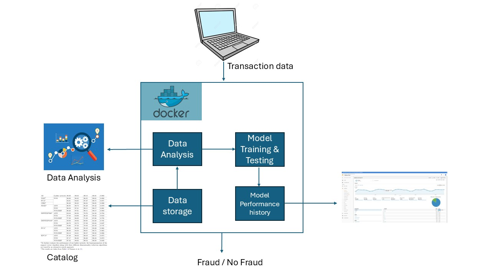

# System Report of SecureBank Fraud Detection System

## System Design

### Overview

The SecureBank Fraud Detection System is a proposed new system designed to effectively identify and prevent fraudulent transactions using machine learning. Packaged within Docker containers, the architecture ensures consistency across various environments and enhances scalability, making it adaptable to the dynamic nature of financial transactions. By leveraging real-time data, the system predicts fraud risks as transactions occur, allowing for immediate action.

The system requires the following data from a transaction: ```'trans_date_trans_time', 'cc_num', 'unix_time', 'merchant', 'category', 'amt', 'merch_lat', 'merch_long'```. Once received, the system identifies the user and combines the transaction data with the user information to run inference using a selected pre-existing model.



### System Requirements

1. **Model Performance -** 
    The proposed system slightly outperforms the older system. The older system reported a precision of 30% and a recall of 60%. The current system includes the best performing model, Random Forest Version 1 with a variable threshold, achieving a recall of 34% while maintaining precision at 60%. 
2. **Generating new datasets -** 
     The proposed system introduces a method to generate new datasets. This feature creates new training and testing sets, enabling performance tracking of models. This is crucial for evaluating the effectiveness of model updates over time.
3. **Selecting a model -** 
    The system allows administrators to view the performance of currently available pre-trained models. It displays precision, recall, and accuracy for each model, facilitating informed decisions on which model to run for inference. Below is an example catalog produced by the system:

```makefile
              Model Version  Precision   Recall  Accuracy
logistic_regression      v1   0.059038 0.730645  0.946855
      random forest      v1   0.121898 0.625806  0.978223
                lda      v1   0.104839 0.650000  0.973683
     sgd_classifier      v1   0.064606 0.745161  0.950740
```
Administrators can select the best model by name and version, ensuring that the chosen model is utilized for future transactions.

4. **Auditing system performance -**
    The system provides an auditing feature, allowing administrators to test models on generated datasets. This dataset can be replaced by a new dataset or by transaction data collected over a specified timeframe. The auditing feature stores this information in a dataframe, facilitating future audits. Additionally, it generates real-time performance graphs in the terminal.

    ```makefile
    Model precision: 0.10453497309761722
    Model Recall: 0.723404255319149

    Model Performance Over Time
    (Y)     ^
            1 |
    0.95000000 | ⡇⠀⠀⠀⠀⠀⠀⠀⠀⠀⠀⠀⠀⠀⠀⠀⠀⠀⠀⠀⠀⠀⠀⠀⠀⠀⠀⠀⠀⠀⠀⠀⠀⠀⠀⠀⠀⠀⠀⠀⠀⠀⠀⠀⠀⠀⠀⠀⠀⠀⠀⠀⠀⠀⠀⠀⠀⠀⠀⠀
    0.90000000 | ⡇⠀⠀⠀⠀⠀⠀⠀⠀⠀⠀⠀⠀⠀⠀⠀⠀⠀⠀⠀⠀⠀⠀⠀⠀⠀⠀⠀⠀⠀⠀⠀⠀⠀⠀⠀⠀⠀⠀⠀⠀⠀⠀⠀⠀⠀⠀⠀⠀⠀⠀⠀⠀⠀⠀⠀⠀⠀⠀⠀
    0.85000000 | ⡇⠀⠀⠀⠀⠀⠀⠀⠀⠀⠀⠀⠀⠀⠀⠀⠀⠀⠀⠀⠀⠀⠀⠀⠀⠀⠀⠀⠀⠀⠀⠀⠀⠀⠀⠀⠀⠀⠀⠀⠀⠀⠀⠀⠀⠀⠀⠀⠀⠀⠀⠀⠀⠀⠀⠀⠀⠀⠀⠀
    0.80000000 | ⡇⠀⠀⠀⠀⠀⠀⠀⠀⠀⠀⠀⠀⠀⠀⠀⠀⠀⠀⠀⠀⠀⠀⠀⠀⠀⠀⠀⠀⠀⠀⠀⠀⠀⠀⠀⠀⠀⠀⠀⠀⠀⠀⠀⠀⠀⠀⠀⠀⠀⠀⠀⠀⠀⠀⠀⠀⠀⠀⠀
    0.75000000 | ⡇⠀⠀⠀⠀⠀⠀⠀⠀⠀⠀⠀⠀⠀⠀⠀⠀⠀⠀⠀⠀⠀⠀⠀⠀⠀⠀⠀⠀⠀⠀⠀⠀⠀⠀⠀⠀⠀⠀⠀⠀⠀⠀⠀⠀⠀⠀⠀⠀⠀⠀⠀⠀⠀⠀⠀⠀⠀⠀⠀
    0.70000000 | ⡇⠀⠀⠀⠀⠀⠀⠀⠀⠀⠀⠀⠀⠀⠀⠀⠀⠀⠀⠀⠀⠀⠀⠀⠀⠀⠀⠀⠀⠀⠀⠀⠀⠀⠀⣀⣀⡠⠤⠒⠂⠀⠀⠀⠀⠀⠀⠀⠀⠀⠀⠀⠀⠀⠀⠀⠀⠀⠀⠀
    0.65000000 | ⡇⠀⠀⠀⠀⠀⠀⠀⠀⠀⠀⠀⠀⠀⠀⠀⠀⠀⠀⠀⠀⠀⠀⠀⠀⠀⠀⣀⣀⡠⠤⠒⠒⠊⠉⠀⠀⠀⠀⠀⠀⠀⠀⠀⠀⠀⠀⠀⠀⠀⠀⠀⠀⠀⠀⠀⠀⠀⠀⠀
    0.60000000 | ⡇⠀⠀⠀⠀⠀⠀⠀⠀⠀⠀⠀⠀⠀⠀⠀⠀⠀⠀⣀⣀⡠⠤⠒⠒⠊⠉⠀⠀⠀⠀⠀⠀⠀⠀⠀⠀⠀⠀⠀⠀⠀⠀⠀⠀⠀⠀⠀⠀⠀⠀⠀⠀⠀⠀⠀⠀⠀⠀⠀
    0.55000000 | ⡇⠀⠀⠀⠀⠀⠀⠀⠀⣀⣀⡠⠤⠤⠒⠒⠊⠉⠉⠀⠀⠀⠀⠀⠀⠀⠀⠀⠀⠀⠀⠀⠀⠀⠀⠀⠀⠀⠀⠀⠀⠀⠀⠀⠀⠀⠀⠀⠀⠀⠀⠀⠀⠀⠀⠀⠀⠀⠀⠀
    0.50000000 | ⣇⡠⠤⠤⠒⠒⠊⠉⠉⠀⠀⠀⠀⠀⠀⠀⠀⠀⠀⠀⠀⠀⠀⠀⠀⠀⠀⠀⠀⠀⠀⠀⠀⠀⠀⠀⠀⠀⠀⠀⠀⠀⠀⠀⠀⠀⠀⠀⠀⠀⠀⠀⠀⠀⠀⠀⠀⠀⠀⠀
    0.45000000 | ⡇⠀⠀⠀⠀⠀⠀⠀⠀⠀⠀⠀⠀⠀⠀⠀⠀⠀⠀⠀⠀⠀⠀⠀⠀⠀⠀⠀⠀⠀⠀⠀⠀⠀⠀⠀⠀⠀⠀⠀⠀⠀⠀⠀⠀⠀⠀⠀⠀⠀⠀⠀⠀⠀⠀⠀⠀⠀⠀⠀
    0.40000000 | ⡇⠀⠀⠀⠀⠀⠀⠀⠀⠀⠀⠀⠀⠀⠀⠀⠀⠀⠀⠀⠀⠀⠀⠀⠀⠀⠀⠀⠀⠀⠀⠀⠀⠀⠀⠀⠀⠀⠀⠀⠀⠀⠀⠀⠀⠀⠀⠀⠀⠀⠀⠀⠀⠀⠀⠀⠀⠀⠀⠀
    0.35000000 | ⡇⠀⠀⠀⠀⠀⠀⠀⠀⠀⠀⠀⠀⠀⠀⠀⠀⠀⠀⠀⠀⠀⠀⠀⠀⠀⠀⠀⠀⠀⠀⠀⠀⠀⠀⠀⠀⠀⠀⠀⠀⠀⠀⠀⠀⠀⠀⠀⠀⠀⠀⠀⠀⠀⠀⠀⠀⠀⠀⠀
    0.30000000 | ⡇⠀⠀⠀⠀⠀⠀⠀⠀⠀⠀⠀⠀⠀⠀⠀⠀⠀⠀⠀⠀⠀⠀⠀⠀⠀⠀⠀⠀⠀⠀⠀⠀⠀⠀⠀⠀⠀⠀⠀⠀⠀⠀⠀⠀⠀⠀⠀⠀⠀⠀⠀⠀⠀⠀⠀⠀⠀⠀⠀
    0.25000000 | ⡇⠀⠀⠀⠀⠀⠀⠀⠀⠀⠀⠀⠀⠀⠀⠀⠀⠀⠀⠀⠀⠀⠀⠀⠀⠀⠀⠀⠀⠀⠀⠀⠀⠀⠀⠀⠀⠀⠀⠀⠀⠀⠀⠀⠀⠀⠀⠀⠀⠀⠀⠀⠀⠀⠀⠀⠀⠀⠀⠀
    0.20000000 | ⡇⠀⠀⠀⠀⠀⠀⠀⠀⠀⠀⠀⠀⠀⠀⠀⠀⠀⠀⠀⠀⠀⠀⠀⠀⠀⠀⠀⠀⠀⠀⠀⠀⠀⠀⠀⠀⠀⠀⠀⠀⠀⠀⠀⠀⠀⠀⠀⠀⠀⠀⠀⠀⠀⠀⠀⠀⠀⠀⠀
    0.15000000 | ⡇⠀⠀⠀⠀⠀⠀⠀⠀⠀⠀⠀⠀⠀⠀⠀⠀⠀⠀⠀⠀⠀⠀⠀⠀⠀⠀⠀⠀⠀⠀⠀⠀⠀⠀⠀⠀⠀⠀⠀⠀⠀⠀⠀⠀⠀⠀⠀⠀⠀⠀⠀⠀⠀⠀⠀⠀⠀⠀⠀
    0.10000000 | ⡇⠀⠀⠀⠀⠀⠀⠀⠀⠀⠀⠀⠀⠀⠀⠀⠀⠀⢀⣀⣀⣀⣀⣀⣀⣀⣀⣀⣀⣀⣀⣀⣀⣀⣀⣀⣀⣀⣀⣀⡀⠀⠀⠀⠀⠀⠀⠀⠀⠀⠀⠀⠀⠀⠀⠀⠀⠀⠀⠀
    0.05000000 | ⡇⠀⢀⣀⣀⣀⠤⠤⠤⠤⠔⠒⠒⠒⠉⠉⠉⠉⠁⠀⠀⠀⠀⠀⠀⠀⠀⠀⠀⠀⠀⠀⠀⠀⠀⠀⠀⠀⠀⠀⠀⠀⠀⠀⠀⠀⠀⠀⠀⠀⠀⠀⠀⠀⠀⠀⠀⠀⠀⠀
            0 | ⣏⣉⣁⣀⣀⣀⣀⣀⣀⣀⣀⣀⣀⣀⣀⣀⣀⣀⣀⣀⣀⣀⣀⣀⣀⣀⣀⣀⣀⣀⣀⣀⣀⣀⣀⣀⣀⣀⣀⣀⣀⣀⣀⣀⣀⣀⣀⣀⣀⣀⣀⣀⣀⣀⣀⣀⣀⣀⣀⣀
    -----------|-|---------|---------|---------|---------|---------|---------|-> (X)
            | 0         0.5000000 1         1.5000000 2         2.5000000 3        

    Legend:
    -------
    ⠤⠤ Precision
    ⠤⠤ Recall
    ```
### Future changes
A future implementation for the system would involve developing a user interface that enables functionalities such as auditing the system and generating datasets. This interface would enhance user interaction and streamline administrative tasks.

### Summary
The system design incorporates key architectural principles and functionalities to address the requirements for effective fraud detection. The modular structure and real-time processing capabilities position the SecureBank system to adapt to evolving fraud patterns while maintaining high performance and reliability.

## Data, Data Pipelines, and Model

### Description of the Data
The SecureBank Fraud Detection System utilizes three datasets: customer information, transaction details, and fraud records. Key attributes include transaction timestamps, credit card numbers, merchant details, and amounts. Notable patterns observed include the order succession timing for each customer, the correlation between transaction timing (hour, day, month) and fraud incidence, as well as demographic features like age, which significantly influence fraudulent activities. 

The timing correlation with fraudulent transactions allows us to do variable thresholding. For example, we could use a lower threshold to detect fraud during those vulnerable times and reduce increase the threshold during times that are not as vulnerable for fraud.

### Explanation of Data Pipelines

The data pipeline consists of three main modules:

**1. Raw Data Handler** (```raw_data_handler.py```):

- Extract: Loads data from CSV, JSON, or Parquet formats, converting them into pandas DataFrames.
- Transform: Merges transaction, fraud, and customer datasets using unique identifiers (transaction numbers and credit card numbers) to create a comprehensive raw dataset.
- Load: Saves the merged dataset in Parquet format.
- Describe: Outputs dataset characteristics, including size and target variable distribution.

**2. Dataset Designer** (```dataset_design.py```):

- Extract: Imports the cleaned Parquet dataset.
- Sample: Splits the dataset into training and testing sets, with a default 20% split.
- Describe: Provides statistics on training/testing samples, ensuring balanced class distributions.

**3. Feature Extractor** (```feature_extractor.py```):

- Transform: Extracts date components (hour, day, month) and calculates cardholder ages. Also transform the transaction date to trasaction difference for each customer.
- Combine Categories: Bins less frequent categorical values into an 'Other' category to ensure balanced data.
- Convert to Integers: Encodes categorical variables for model input and creates a mapping for interpretation.
Scale Continuous Data: Applies MinMax scaling to normalize numerical features.
- Correlation Analysis: Identifies highly correlated features for potential reduction.

### Description of Inputs and Outputs of the Model
- **Inputs:** The model takes processed features, including transaction time difference for each customer, time variables (hour, day, month), demographic information (age, state, job), and transaction details (amount, merchant, location). The feature set consists of both categorical and continuous variables.
- **Outputs:** The model predicts the likelihood of fraud (binary classification), outputting probabilities and class labels for transactions. The results are utilized for real-time fraud detection, allowing immediate actions to prevent fraudulent activities.

## Metrics Definition 

### Overview of Metrics
The SecureBank Fraud Detection System employs a combination of offline and online metrics to evaluate model performance and guide decision-making processes. These metrics focus on key aspects of fraud detection, such as the accuracy of identifying fraudulent transactions and the system's ability to adapt over time. By utilizing like precision and recall, we ensure a balanced approach that minimizes both false positives and false negatives in fraud detection.

### Offline Metrics
**1. Precision:**
Precision measures the proportion of true positive predictions among all positive predictions made by the model.

$\text{Precision}=\frac{TP}{TP + FP}$

TP = True Positives (correctly identified fraudulent transactions)
FP = False Positives (non-fraudulent transactions incorrectly identified as fraudulent)

High precision indicates that the model is effective at correctly identifying fraud, which is crucial in reducing the number of legitimate transactions flagged as fraudulent.

**2. Recall:**
Definition: Recall measures the proportion of true positive predictions among all actual positive cases in the dataset.

$\text{Recall}=\frac{TP}{TP + FN}$

TP = True Positives (correctly identified fraudulent transactions)
FN = False Negatives (fraudulent transactions that were not identified by the model)

High recall is essential for ensuring that most fraudulent transactions are caught, which is critical for minimizing financial losses.

**3. Accuracy:**
Definition: Accuracy measures the overall proportion of correct predictions made by the model.

$\text{Accuracy} = \frac{TP + TN}{TP + TN + FP + FN}$

TP = True Positives (correctly identified fraudulent transactions).
TN = True Negatives (non-fraudulent transactions correctly identified).
FP = False Positives (non-fraudulent transactions incorrectly identified as fraudulent)
FN = False Negatives (fraudulent transactions that were not identified by the model)

While accuracy is a useful metric to track, it may be misleading in cases of imbalanced datasets. Therefore, it should be interpreted alongside precision and recall.

### Online Metrics
**1. Real-Time Precision and Recall Monitoring**
Continuously monitors precision and recall during live transactions to assess the model's performance in real-time.
Purpose: Enables prompt adjustments to the model or thresholds based on current performance, ensuring ongoing effectiveness in fraud detection.

**2. Performance Tracking Over Time**
A method to store and visualize precision, recall, and F1 score metrics over time to assess trends and model stability.
Purpose: Facilitates informed decision-making for model retraining or switching, based on observed performance trends.

**3. Threshold Optimization**
Definition: Adjusts decision thresholds dynamically based on the observed distribution of fraud incidents in real-time data.
Purpose: Enhances the model's responsiveness to changing fraud patterns, optimizing the balance between precision and recall based on current data trends.

### Conclusion
The metrics defined above are critical for ensuring that the SecureBank Fraud Detection System operates effectively and adapts to changing fraud patterns. By focusing on precision, recall and real-time monitoring, the system can maintain high performance while minimizing the risk of undetected fraud or excessive false positives. Continuous evaluation of these metrics will guide future enhancements, model selection, and overall system improvement.