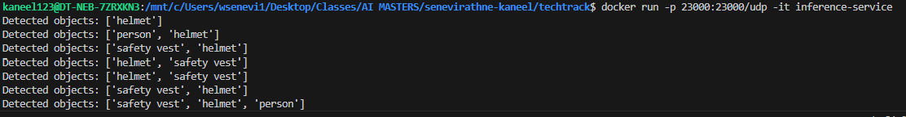
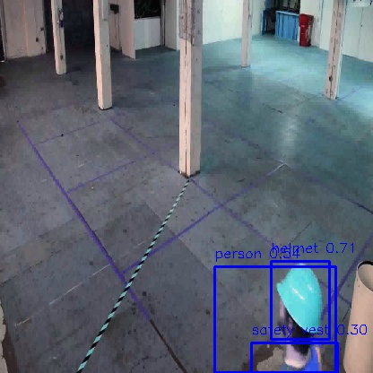

# TechTrack - Object Detection System

## Description
TechTrack is a pilot object detection system designed for robotic applications in warehouse environments. This repository provides a suite of tools enabling users to perform video-based inference using the current detection model (YOLO-v1/YOLO-v2), save the resulting images, apply augmentations for retraining, identify challenging (hard-to-classify) images, and run object detection and prediction tasks with the existing system.

## Table of Contents
- Prerequisites.
- Installation.
- Example usage.

## Prerequisites
This interface system uses Docker to containerize and run the application. Ensure Docker is installed on your machine before proceeding. The rectification system and analysis notebooks uses python3 and opencv-python. Ensure these libraries and services are installed on your machine before proceeding. The requirements.txt file is available to see what modules are needed.

## Installation
Follow the steps below to set up and run the application:

1. **Clone the repository:**
```bash
git clone https://github.com/creating-ai-enabled-systems-fall-2024/senevirathne-kaneel.git
```
2. **Navigate to the ```techtrack``` directory:**
```bash
cd techtrack
```
3. **Build the Docker image. Replace ```<appname>``` with the desired name for your application (e.g., ```flask-app```):**
```bash
docker build -t <appname>:latest .
```
## Example Usage 

### Interface service ###

If you want to test out the interface service, run the following code after building the docker image. 
```bash
docker run -p 23000:23000/udp -it <appname>
```
Then in a seperate terminal type the following. Replace ```<video directory>``` with your test video directory.
```bash
ffmpeg -re -i <video directory> -r 30 -vcodec mpeg4 -f mpegts udp://127.0.0.1:23000
```
Below is an example of the interface service detecting objects. 



Below is an example image detected by the interface service. 



### Rectification Service ###

To access rectification service help. Run the following code. 
```bash
rectification_service.py -h
```
```bash
usage: rectification_service.py [-h] --prediction_dir PREDICTION_DIR --annotation_dir ANNOTATION_DIR --output_dir OUTPUT_DIR [--num_samples NUM_SAMPLES] [--iou_threshold IOU_THRESHOLD]

Rectification service for hard negative mining and image augmentation.

optional arguments:
  -h, --help            show this help message and exit
  --prediction_dir PREDICTION_DIR
                        Path to the directory containing prediction files.
  --annotation_dir ANNOTATION_DIR
                        Path to the directory containing annotation files.
  --output_dir OUTPUT_DIR
                        Path to the directory where augmented images will be saved.
  --num_samples NUM_SAMPLES
                        Number of hard negatives to sample and augment.
  --iou_threshold IOU_THRESHOLD
                        IoU threshold for selecting hard negatives.
```

Example usage.
```bash
python rectification_service.py --prediction_dir <prediction_directory> --annotation_dir <annotation_directory> --output_dir <output_directory> --num_samples 10 --iou_threshold 0.5
```


