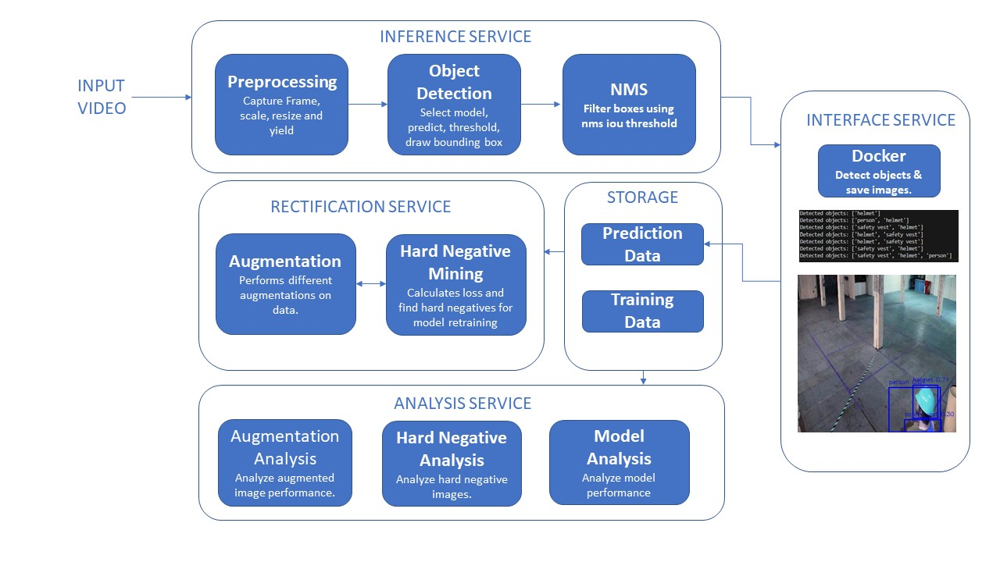
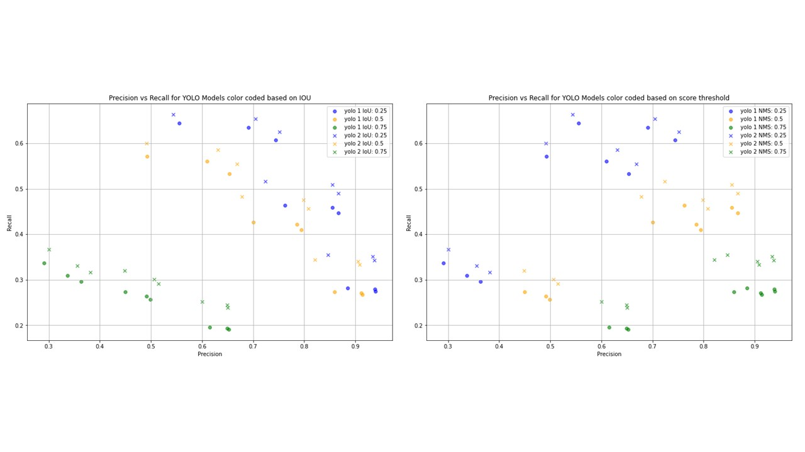
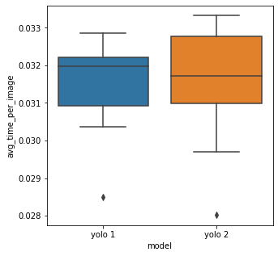
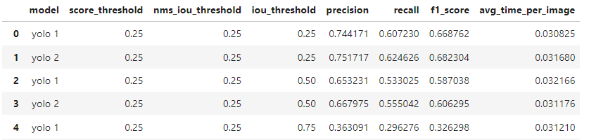
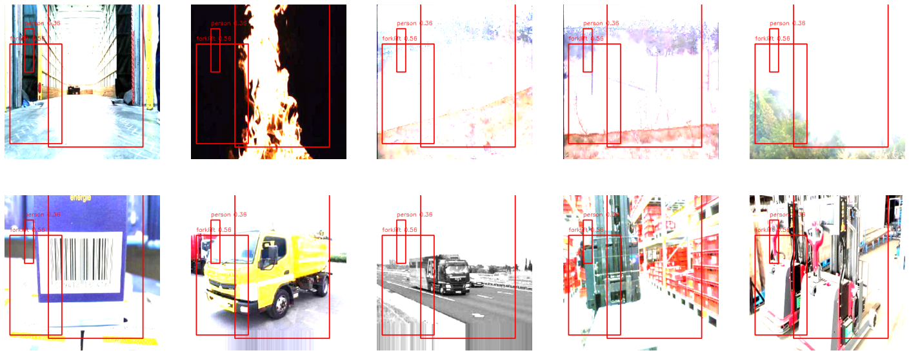

# System Report of TechTrack Object Detection System

## System Design

### Overview ###

TechTrack is a computer vision system specifically designed for robotic object detection in warehouse environments. By processing live video feeds, the system accurately identifies key objects such as people, helmets, and safety vests, ensuring both safety and operational efficiency. Leveraging the power of the YOLO model, TechTrack can detect objects from video input and store the data for continuous model improvement through retraining.

The system features an advanced inference pipeline that processes video frames, performs object detection, and applies non-maximal suppression to filter overlapping results. Additionally, TechTrack employs data augmentation and hard negative mining to enhance the model’s performance over time. A set of comprehensive analysis modules evaluates the system's overall effectiveness, providing insights to fine-tune detection accuracy and performance.

Designed with a modular architecture, TechTrack consists of distinct services for inference, interaction, rectification, and analysis. These components work seamlessly to deliver accurate and reliable object detection while maintaining flexibility and scalability for robotic operations in warehouse environments.

### Inference Service ###

The Inference Service starts with Preprocessing, where frames from the input video are captured, scaled, resized, and prepared for processing. These frames are passed to the Object Detection module, which selects the appropriate model, predicts object classes, applies score thresholds, and draws bounding boxes around detected objects. The NMS (Non-Maximum Suppression) module is then applied to filter overlapping bounding boxes using Intersection-over-Union (IoU) thresholds, ensuring that only the most accurate detections are retained. The results are fed into downstream services for further processing or storage.

### Interface Service ###

The Interface Service facilitates communication between TechTrack and external components. It leverages Docker to manage object detection tasks, including capturing and saving images with detected objects. The system identifies objects such as people, helmets, and safety vests, logging them in real-time and displaying bounding boxes around detected objects in the user interface. The results, including bounding boxes, predicted classes, and probabilities in YOLO format, are saved along with the video frames. This enables both visual inspection of detection outcomes and analytical measurement of model performance, paving the way for future model retraining, particularly with hard negative samples.

### Rectification Service ###

The Rectification Service is dedicated to enhancing the system's detection accuracy. It begins with Augmentation, where various transformations are applied to the input data to create diverse scenarios for model retraining. This process is especially useful for detecting objects in challenging situations, such as during a warehouse fire with heavy smoke, where augmentations help the model learn to detect objects like humans in these adverse conditions. Additionally, Hard Negative Mining identifies difficult false positives or missed detections by calculating the loss and isolating the most challenging examples for the model. These hard negatives are then used to fine-tune the model, improving its performance in handling complex detection cases.

### Analysis Service ###

The Analysis Service assesses the system's overall performance. The Augmentation Analysis module evaluates the impact of various data augmentations on detection accuracy, simulating adverse warehouse scenarios such as mist or smoke that may not naturally occur. This testing environment helps ensure the model can handle unexpected conditions. The Hard Negative Analysis module reviews images flagged through Hard Negative Mining to uncover patterns in the model's errors, providing valuable insights for correction. Finally, the Model Analysis module provides a thorough assessment of the model’s performance, identifying the best-performing versions over time. It also evaluates the speed-accuracy trade-off, ensuring the model is optimized for real-world object detection before deployment.

## Metrics Definition

### Offline Metrics ###

In evaluating our object detection system, offline metrics such as Precision, Recall, and Mean Average Precision (mAP) are critical for understanding the models' performance and guiding improvements. Precision measures the accuracy of positive predictions by calculating the proportion of true positives among all predicted positives, while Recall assesses the models' ability to identify all relevant instances, reflecting the ratio of true positives to total actual positives. Mean Average Precision provides a holistic evaluation by averaging precision across various Intersection over Union (IoU) thresholds, offering deeper insights into detection performance. By leveraging these offline metrics in conjunction with hard negative mining and data augmentation we can identify challenging instances where the models struggle. This targeted approach allows us to retrain the models with these hard negatives and augmented images enhancing their ability to detect objects accurately in complex scenarios. Consequently, the iterative process of assessing offline metrics and refining the training dataset through hard negative mining ensures continuous improvement in detection capabilities, ultimately leading to a more robust object detection system in the warehouse environment.

### Online Metrics ###

For real-time monitoring of our object detection system, online metrics such as the time taken to detect an object in an image are essential to ensure system responsiveness and efficiency. This metric tracks the latency of the detection process, providing insights into how quickly the models can process incoming video frames and generate bounding box predictions. Additionally, we can include metrics such as Frames Per Second (FPS) to evaluate the system's throughput, as well as the success rate of detections over time to ensure consistent performance. Monitoring these online metrics can be achieved through logging and visualization tools that display real-time analytics, allowing for immediate identification of performance bottlenecks and enabling proactive adjustments to maintain optimal operation within the warehouse setting.

## System Parameters and Configurations

### Model Selection for Inference Service ###

The selection of the object detection model, such as YOLO, directly influences the speed and accuracy of the system. YOLO (You Only Look Once) is particularly useful for real-time applications due to its balance between speed and accuracy. YOLO’s speed allows for near real-time detection, which is crucial in a dynamic environment like a warehouse. However, the trade-off is that it may not capture fine details, which could lead to missed detections. 

After selecting YOLO as the model, I analyzed different YOLO model versions using the test dataset to find the best version for deployment. In order to do this, I conducted an analysis to find the best thresholds for the score and IOU for the bounding box produced by each model. 

The results showed that yolo model 2 (labeled with 'x') had the highest precision and recall combination out of all other combinations of iou threshold and score thresholds. 

I further conducted a time analysis to find the faster model. Results showed that the YOLO model v2 was slightly faster running inference on a single image compared to v1. So YOLO model v2 was chosen as the model for deployment. 

### IOU, score and NMS threshold selection for Inference Service ###

Non-Maximal Suppression (NMS) plays a crucial role in filtering overlapping bounding boxes and retaining only the most confident detections during object detection. Adjusting the NMS IOU threshold, score threshold, and IOU selection is key to optimizing detection performance, as these parameters help balance precision and recall. Setting the thresholds too high could result in the system failing to distinguish closely placed objects, such as stacked boxes in a warehouse, leading to missed detections. Conversely, if the thresholds are too low, the system might suppress too many valid detections, increasing false positives. To address this, I tested various NMS IOU thresholds, score thresholds, and IOU selection strategies to find the optimal configuration for warehouse object detection. The evaluation process involved using recall and precision metrics to find a balanced configuration that minimized errors while maintaining robust detection, ensuring optimal performance for warehouse object detection. Below is a table of the tested IOU, NMS and score thresholds for both models to select the optimal threshold for high recall and precision values. 

Looking at the above table, YOLO model v2 with a score threshold of 0.25, nms_iou_threshold of 0.25 and an iou_threshold of 0.25 was selected because of its high precision and recall (0.75 and 0.62) respectively. While some other threshold combinations showed high precisions, recall values were low, thus the thresholds that produced good precision and recall were chosen.

### Data Augmentation Technique Selection for Rectification ###

Implementing data augmentations such as rotation, scaling, and contrast adjustments enables the model to adapt to unexpected scenarios, such as poor lighting or smoke in the warehouse. These augmentations enhance the model's robustness in adverse conditions, thereby reducing errors in critical situations. For instance, simulating smoke or mist-like conditions can significantly improve the model's ability to detect objects in low-visibility environments. To evaluate the impact of data augmentation, I generated various augmented images and conducted a visual analysis of the model's performance with these modifications. For example, adjusting the contrast adversely affected the model's accuracy. 

The image above illustrates that the model's performance can decline on particularly sunny days. This highlights the importance of incorporating data that may not be present in the training set but can replicate real-world adverse scenarios for effective model retraining.

### Hard Negative Mining Stratergy for Rectification ###

I implemented a hard negative mining strategy that excluded Non-Maximal Suppression (NMS) before calculating the loss, allowing for a more comprehensive evaluation of the model's performance. This approach revealed that many of the highest loss values stemmed from multiple bounding boxes surrounding the same object, indicating a significant area of confusion for the model. Additionally, I discovered that the model struggled to accurately predict vehicle types, which contributed further to elevated loss levels. By visually analyzing these results, I identified specific scenarios where the model faltered, providing invaluable insights for retraining. This targeted approach enables adjustments to focus on the challenging examples that lead to misclassifications and false positives, ultimately enhancing the system's reliability and accuracy in object detection.

Excluding NMS in this analysis facilitated the capture of all predictions, including overlapping bounding boxes. This allowed me to pinpoint scenarios where multiple boxes were incorrectly predicting the same object, shedding light on the model's limitations in differentiating closely situated objects. By recognizing these patterns without the filtering effect of NMS, I gained a clearer understanding of the model's weaknesses. This knowledge is crucial for retraining, as it allows for the incorporation of these hard negatives into the training dataset, honing in on the specific instances where the model struggles. By addressing these problematic cases, the model can improve its ability to make accurate distinctions in complex scenarios, leading to overall enhanced performance in future object detection tasks.

### Using Docker for Interface Service ###

The use of Docker in managing object detection processes significantly enhances the performance of the system by enabling efficient handling of heavy computational tasks. By leveraging Docker alongside FFmpeg and UDP streams to capture frames and run inference, the system can process video input seamlessly while maintaining real-time monitoring capabilities. This modular approach allows for easy scalability, ensuring that the system can efficiently manage multiple instances of object detection in large-scale warehouse operations. Additionally, the isolation provided by Docker ensures that the object detection processes do not interfere with one another, resulting in consistent performance across various tasks. This strategy ultimately streamlines the workflow, enhances the responsiveness of the object detection system, and supports effective resource management.