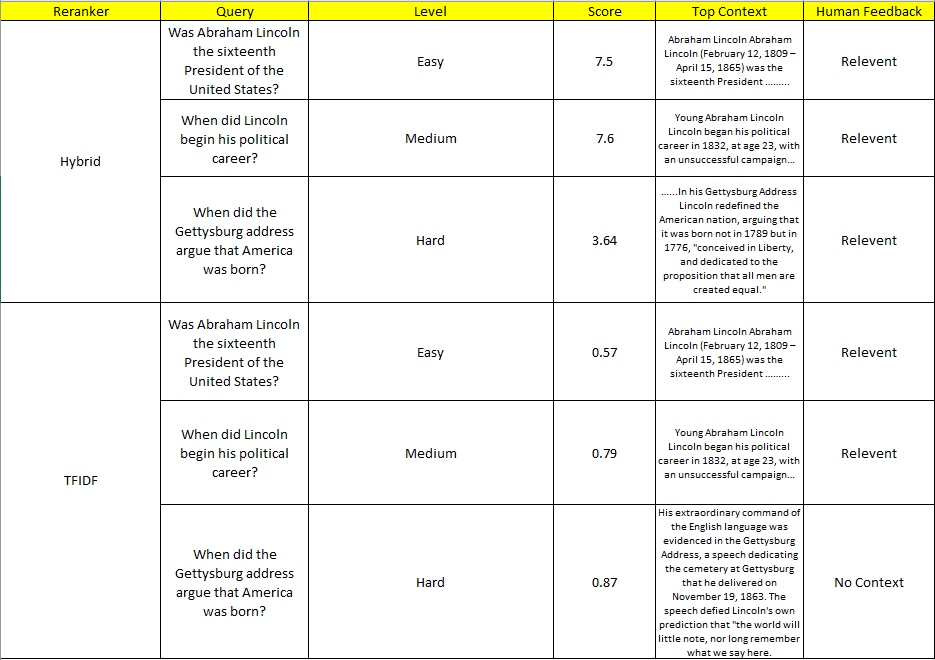
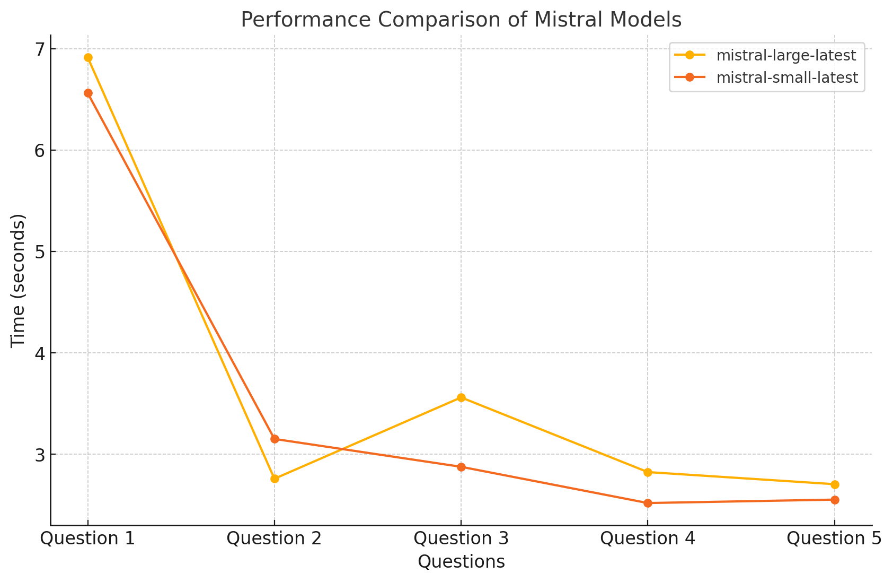
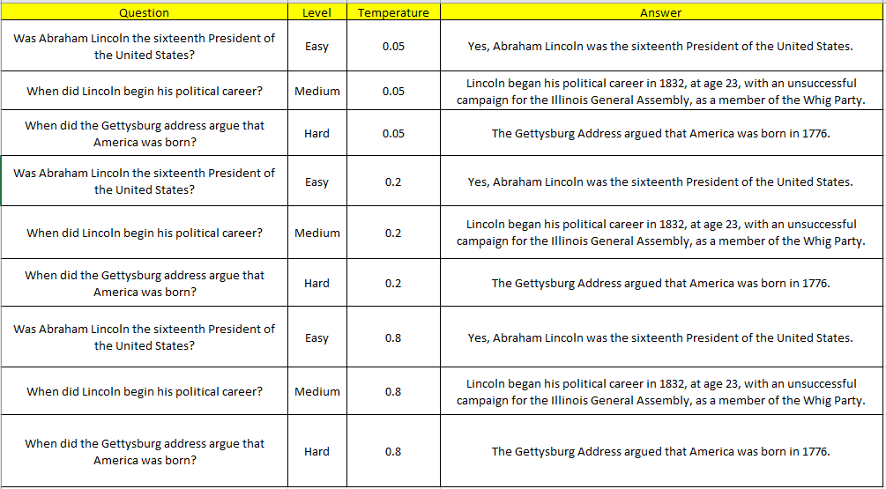

# System Report of Textwave 

## System Design

### Overview ###

The TextWave system is composed of several integrated components designed to provide retrieval-augmented generation for query answering. Trained on a corpus containing relevant company information, the system can retrieve content from an already trained FAISS index in response to a query. The system includes an extraction module that generates the query embedding, a retrieval module that searches for relevant content in the index, a generator module that leverages the MISTRAL AI API to generate answers based on the retrieved content, and an interface module that uses Docker to facilitate communication with the user.

### Extraction Module ###

The extraction module consists of two key services: the preprocessing service and the embedding service. The preprocessing service handles document parsing using various chunking strategies to prepare the data for embedding. Once parsed, the processed documents are passed to the embedding service, which is responsible for generating embeddings using a specified model (e.g., 'all-MiniLM-L6-v2') and saving them in the FAISS index.

### Retrieval Module ###

The retrieval module consists of three key methods: the indexing method, the reranking method, and the search method. The indexing method is used to store the extracted embeddings from documents provided by company managers, which include company-related data. It supports various indexing strategies, offering flexibility in how the embeddings are stored. The search method retrieves the k nearest neighbors based on a query embedding. These k neighbors are then passed to the reranking method, which reorders the embeddings using different reranking techniques, such as hybrid, cross-encoder, TF-IDF, and others. 

### Generator Module ###

The generator module utilizes the MISTRAL AI API to generate answers to queries by combining the query with the k nearest neighbors (context) retrieved from the FAISS index created from the company’s corpus. The module allows the user to select a generator model from the available MISTRAL AI models, such as 'mistral-large-latest'.

### Interface Module ###

The interface module is a containerized application that provides two endpoints for interacting with the service. The /query endpoint allows users to input a question, which the system then preprocesses. It searches the index for relevant content, requests an answer from the MISTRAL API, and returns the generated response to the user. Users can adjust the number of k nearest neighbors, offering flexibility in the content passed to the API. The interface also has an endpoint /update_corpus to add new documents to the company corpus so that the index can be updated with new information. 

## Metrics Definition

### Offline Metrics ###

To evaluate the performance of the TextWave system, we use several offline metrics to ensure it 
retrieves accurate and relevant information for generating answers. One key metric is **exact match**, 
which checks if the content retrieved from the FAISS index perfectly matches the correct information 
in our test data. Another metric is **transformer matching**, which measures how similar the retrieved 
content is to the correct answers by comparing their meanings using a transformer model. This helps us 
understand whether the system is retrieving semantically relevant information, even if the words do not 
match exactly. Additionally, **manual feedback checking** is a critical metric: the system saves queries 
and answers, and expert human reviewers grade the results based on their accuracy and quality. 
This provides deeper insights into how well the system performs in real-world scenarios and helps 
identify areas for improvement. Together, these metrics ensure that the system consistently retrieves 
and generates high-quality responses.

### Online Metrics ###

To monitor and improve the real-time performance of the TextWave system, we use several online metrics that evaluate its responsiveness and 
user satisfaction. One key metric is response time, which measures the time taken to process a query and generate an answer. A fast response 
time is essential to ensure a smooth user experience. Another important metric is retrieval efficiency, which tracks how quickly the system 
searches the FAISS index and fetches the most relevant results, helping us assess the performance of the retrieval module under different query 
loads.

We also monitor generation latency, which measures the time taken by the generator module to produce an answer using the MISTRAL API. 
This helps us identify potential bottlenecks in the answer generation step. Additionally, user interaction metrics such as click-through 
rates (whether users act on the provided answers) and query abandonment rates (whether users leave without waiting for a response) provide 
insights into how well the system meets user expectations in real-time scenarios. Combining these metrics helps ensure the system remains 
efficient, accurate, and user-friendly during actual usage.

## Analysis of Designing Parameters and Configurations

### Retrieval Service: Choosing 'hybrid' reranker method as the reranking service ###

In order to choose the best reranking service for the design, I checked different level queries (easy, medium, hard) and analyzed the top 5 reranked documents. 

Below is a comparison between the Hybrid and TFIDF reranking methods. Here you can see the question, its level and the top context reranked by each method. Then human feedback is given to see the relevency of the context to see if its relevent. Focusing on the image you can see that the Hybrid method has reranked the top context for the hard question better while the TFIDF method has reranked a context that mentions the "Gettysburg Address" however, has failed to identify the correct document that answers the question. 

Further analysis of all the reranking methods highlights the strengths and limitations of reranking strategies—TF-IDF and the hybrid approach utilizing cross-encoders. The TF-IDF method excels in keyword-based retrieval, effectively identifying documents with high contextual relevance for straightforward queries like Lincoln's presidency. Its ability to prioritize documents with direct answers is commendable; however, it may falter with more nuanced queries, where it occasionally elevates tangentially related documents over precise matches, as seen with the Gettysburg Address. On the other hand, the hybrid reranking strategy demonstrates a more sophisticated approach to document relevance by integrating the strengths of both TF-IDF and cross-encoders. This strategy successfully prioritizes documents that align closely with the query intent, effectively re-ranking based on semantic understanding. While it showcases improved precision, particularly for straightforward and moderately complex queries, the strategy still encounters challenges with multifaceted historical interpretations, where relevance may decrease for lower-ranked documents. Given these observations, the hybrid reranking method is recommended for our work. It not only retains the efficiency of TF-IDF in narrowing down relevant documents but also leverages the nuanced understanding provided by cross-encoders for more 
accurate semantic retrieval. 

*For more details on the analysis go to notebooks/reranker_analysis.ipynb*

### Extraction Service: Use of chunking methods ###

The system utilizes a chunking strategy with a fixed length of 100 words and an overlap of 3 words between consecutive chunks. This approach ensures continuity and coherence across chunks, as the overlapping words create a seamless transition, reducing the risk of losing critical context. The fixed word length is optimized for the input size limitations of language models, ensuring efficient processing while retaining sufficient information for accurate analysis. The overlap maintains semantic flow and enhances the model's ability to generate contextually relevant queries. This design balances computational efficiency with preserving the document's meaning in the RAG-based pipeline.

### Generation Service: Choosing "mistral-large-latest" as the generator model ###

To select the best model out of "mistral-large-latest" and "mistral-small-latest" a time efficiency test was conducted. Both models were tested on 5 questions and a context to measure the time elapsed to generate the answer. This was done to see if the "large" model answer generation time is longer than the "small" model. The analysis showed that the times were not significantly different in order to choose the "smaller" model. Thus the "mistral-large-latest" model was chosen because it is the top reasoning model available. 

### Generation Service: Choosing a temperature of 0.2 ###

A testing different temperatures and manually going through answers gives the following sentiment. A temperature setting of 0.2 seems to be ideal for a company document retrieval system because it strikes a balance between predictability and flexibility, making responses clear and consistent. At this low temperature, the model provides deterministic answers, ensuring that the information retrieved is accurate and directly relevant to the query, without introducing unnecessary or off-topic details. This minimizes the risk of overfitting or bias, maintaining a neutral tone in the responses. Furthermore, the low temperature reduces the chance of creative or overly specific content that might diverge from the factual context, which is crucial in professional settings. Overall, 0.2 offers a good balance, providing precise, neutral, and factual information without sacrificing slight variations in phrasing, making it an excellent choice for a document retrieval system.

### Choosing docker as the interface service ###

Docker was selected as the interface module due to its ability to provide a containerized environment for the TextWave system. This ensures scalability, modularity, and ease of deployment across different environments. By using Docker, the system can support regular updates to the corpus by mounting new documents, without requiring downtime or manual reconfiguration. Additionally, Docker simplifies scaling the Flask API for handling increased query volumes. It also lays the groundwork for creating a web app, allowing users to input queries interactively. This combination of flexibility, scalability, and maintainability makes Docker an ideal choice for the TextWave system. Using curl to send a JSON file containing the API, k (nearest neighbors), and the query to the Flask endpoint ensures a lightweight and efficient query submission method. This setup allows for easy integration with other systems or pipelines. Additionally, it supports mounting updated corpo documents frequently, keeping the system dynamic and adaptable. This method is particularly beneficial for scaling, as Docker’s containerization ensures that multiple instances of the service can be spun up to handle high query loads. Finally, this approach simplifies extending the system into a web app, where users can input queries through a graphical interface, enhancing user accessibility. Furthermore, docker enables to run this in serverless containers such as Google Cloud Run which makes is more financially efficient for a in house company information retrieval system. 